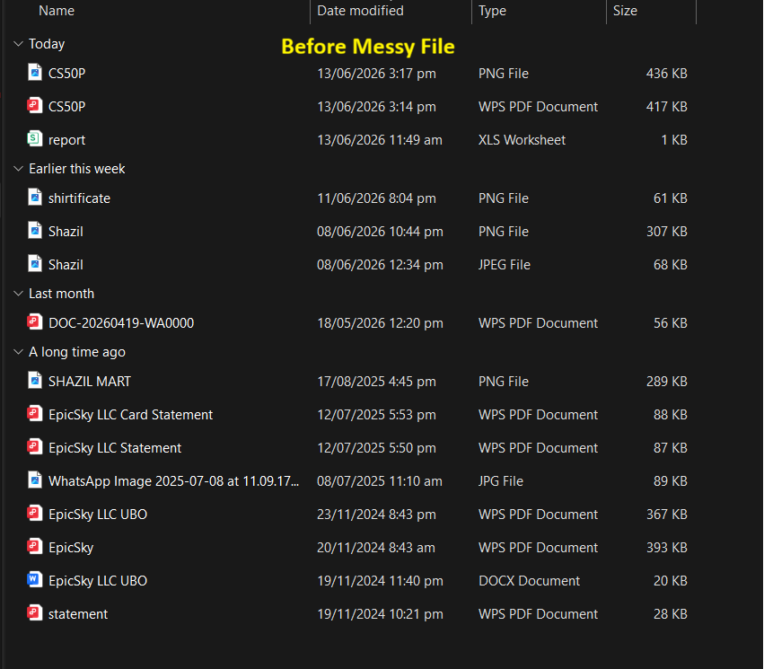
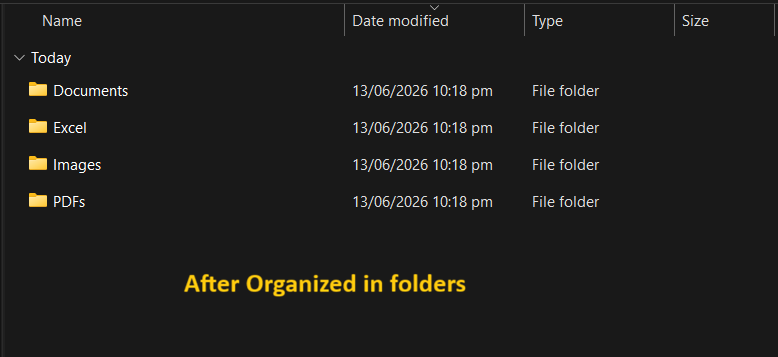

# 📂 Auto File Organizer

> A Python automation tool that organizes any folder by file type — with smart defaults, user control, and graceful error handling.

Built by **Shazil Waqar** · Python Automation Project

---

## 🚀 What It Does

Tired of a messy Downloads folder? This tool scans any folder and automatically moves files into organized subfolders based on their type — in seconds.

**Example:**
```
Before                        After
──────────────────────        ──────────────────────
Downloads/                    Downloads/
├── photo.jpg                 ├── Images/
├── report.pdf                │   └── photo.jpg
├── song.mp3                  ├── PDFs/
├── notes.docx                │   └── report.pdf
└── data.xlsx                 ├── Audio/
                              │   └── song.mp3
                              ├── Documents/
                              │   └── notes.docx
                              └── Excel/
                                  └── data.xlsx
```

---

## ✨ Features

- 📁 Auto-sorts files into labeled folders by type
- 🖥️ Works on **Windows, Mac, and Linux** — no hardcoded paths
- 🎯 Lets user choose **any folder** or use Downloads as smart default
- 🛡️ Handles errors gracefully — locked files, duplicates, bad paths
- ⚡ Zero dependencies — uses Python built-in modules only
- 🔄 Creates destination folders automatically if they don't exist
- ⏭️ Safely skips folders and unsupported file types

---

## 📦 Supported File Types

| Folder | Extensions |
|--------|-----------|
| 🖼️ Images | `.jpg` `.jpeg` `.png` `.gif` |
| 📄 PDFs | `.pdf` |
| 🎬 Videos | `.mp4` `.mkv` `.avi` |
| 🎵 Audio | `.mp3` `.wav` |
| 📝 Documents | `.doc` `.docx` `.txt` |
| 📊 Excel | `.xls` `.xlsx` `.csv` |
| 🗜️ Archives | `.zip` `.rar` `.7z` |

---

## 🛠️ Tech Used

| Tool | Purpose |
|------|---------|
| `os` | Path handling, folder scanning, cross-platform paths |
| `shutil` | Safe file moving |
| `try/except` | Graceful error handling |

No pip install needed — 100% Python standard library.

---

## ▶️ How to Run

**1. Make sure Python is installed**
```bash
python --version
```

**2. Clone this repo**
```bash
git clone https://github.com/shazilwaqar/auto-file-organizer
cd auto-file-organizer
```

**3. Run the script**
```bash
python main.py
```

**4. Choose your folder**
```
Enter folder path to organize (press Enter for C:\Users\Shazil\Downloads):
```
- Press **Enter** → organizes your Downloads folder
- Type any path → organizes that folder instead

---

## 🧠 Key Concepts Used

```python
# Works on any OS - no hardcoded paths
os.path.expanduser("~")

# User can pick folder or use smart default
source = user_input.strip() or default

# Handles errors without crashing
try:
    shutil.move(...)
except PermissionError:
    print("File is locked")
except FileExistsError:
    print("File already exists, skipping")
```

## 📸 Screenshots

### Before


### After


---


## 👨‍💻 Author

**Shazil Waqar** — Python Developer  
